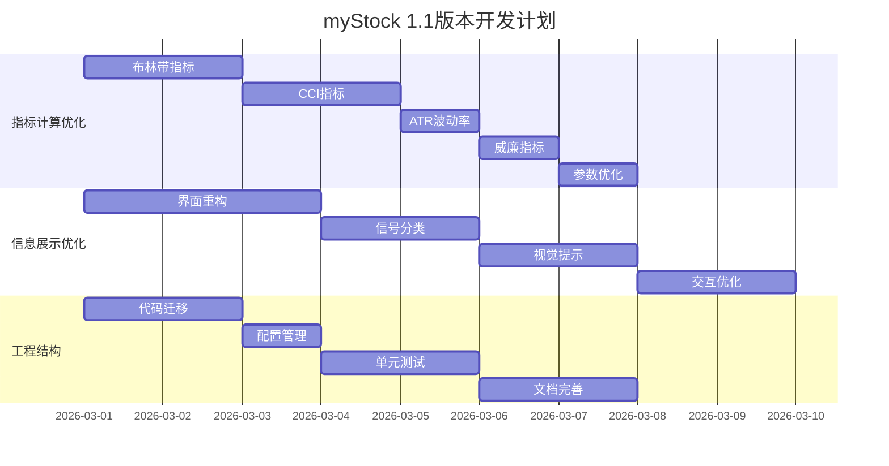
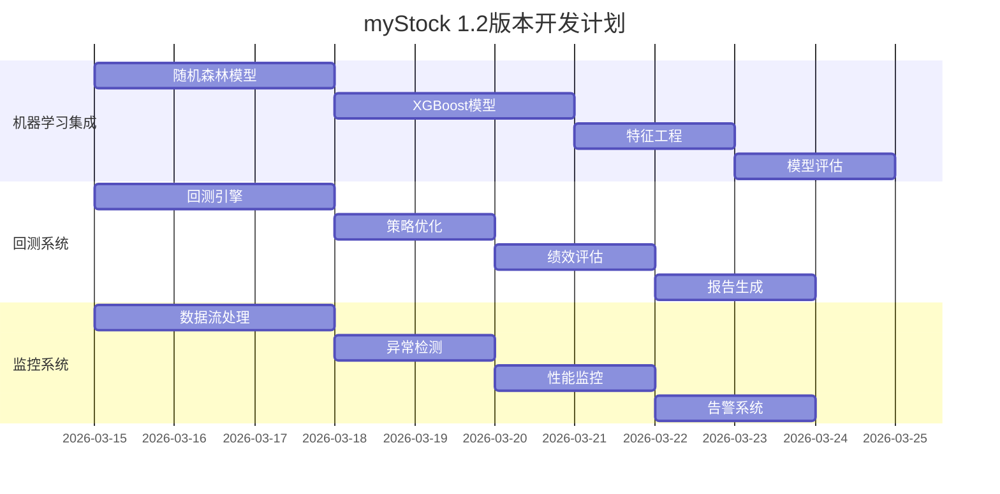
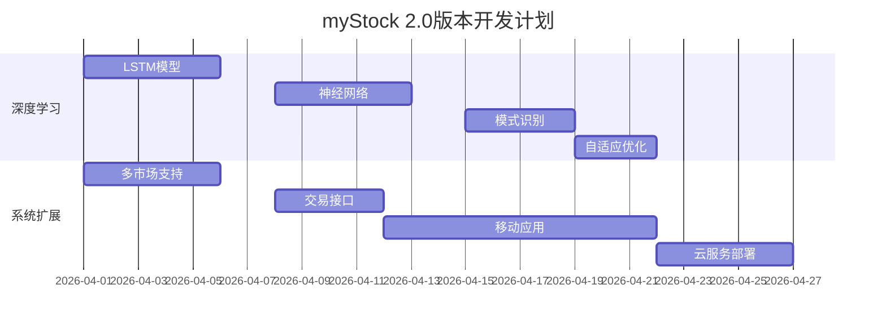

# myStock 改进计划 V2.0

## 🎯 项目状态

### 当前版本: 1.0 (稳定可用)
- ✅ 基础数据获取和存储
- ✅ 基本技术指标计算 (MACD, KDJ, RSI)
- ✅ Web API服务 (端口9991)
- ✅ 定时任务调度
- ✅ 基础交易信号生成

### 目标版本: 2.0 (智能增强)
- 🎯 增加高准确率技术指标
- 🎯 优化信息展示和交互
- 🎯 集成机器学习算法
- 🎯 完善回测和监控系统

## 📋 改动分级计划

### P0优先级 (立即开始，1-2周)

#### 1. 指标计算优化
**目标**: 增加机构常用高准确率指标

| 任务 | 描述 | 预计时间 | 负责人 |
|------|------|----------|--------|
| 增加布林带指标 | 趋势和波动率分析 | 2天 | 开发团队 |
| 实现CCI顺势指标 | 趋势强度判断 | 2天 | 开发团队 |
| 添加ATR波动率 | 止损和仓位管理 | 1天 | 开发团队 |
| 集成威廉指标 | 超买超卖判断 | 1天 | 开发团队 |
| 优化现有参数 | MACD/RSI/KDJ参数优化 | 1天 | 开发团队 |

#### 2. 信息展示优化
**目标**: 改进用户界面和交互体验

| 任务 | 描述 | 预计时间 | 负责人 |
|------|------|----------|--------|
| 重构HTML界面 | 现代化卡片设计 | 3天 | 前端开发 |
| 实现信号分类 | 按强度/类型/行业分类 | 2天 | 前端开发 |
| 添加视觉提示 | 颜色/图标/动画提示 | 2天 | 前端开发 |
| 优化交互功能 | 悬停/点击/拖拽功能 | 2天 | 前端开发 |
| 移动端适配 | 响应式设计优化 | 2天 | 前端开发 |

#### 3. 工程结构重组
**目标**: 创建模块化可维护的代码结构

| 任务 | 描述 | 预计时间 | 负责人 |
|------|------|----------|--------|
| 迁移现有代码 | 按新结构组织代码 | 2天 | 开发团队 |
| 创建配置文件 | 统一配置管理 | 1天 | 开发团队 |
| 编写单元测试 | 关键功能测试覆盖 | 2天 | 测试团队 |
| 完善文档 | API文档和用户指南 | 2天 | 文档团队 |

### P1优先级 (1-2周后开始)

#### 1. 机器学习集成
**目标**: 提升预测准确率

| 任务 | 描述 | 预计时间 | 负责人 |
|------|------|----------|--------|
| 集成随机森林 | 多指标组合预测 | 3天 | 数据科学家 |
| 实现XGBoost | 梯度提升树预测 | 3天 | 数据科学家 |
| 特征工程 | 技术指标特征提取 | 2天 | 数据科学家 |
| 模型评估 | 准确率/召回率评估 | 2天 | 数据科学家 |

#### 2. 回测系统开发
**目标**: 策略验证和优化

| 任务 | 描述 | 预计时间 | 负责人 |
|------|------|----------|--------|
| 回测引擎 | 历史数据回测 | 3天 | 开发团队 |
| 策略优化器 | 参数网格搜索 | 2天 | 开发团队 |
| 绩效评估 | 夏普比率/最大回撤 | 2天 | 开发团队 |
| 报告生成 | 可视化回测报告 | 2天 | 开发团队 |

#### 3. 实时监控系统
**目标**: 系统稳定性和性能监控

| 任务 | 描述 | 预计时间 | 负责人 |
|------|------|----------|--------|
| 数据流处理 | 实时数据处理管道 | 3天 | 开发团队 |
| 异常检测 | 系统异常自动检测 | 2天 | 开发团队 |
| 性能监控 | 系统性能指标监控 | 2天 | 开发团队 |
| 告警系统 | 异常情况自动告警 | 2天 | 开发团队 |

### P2优先级 (1个月后开始)

#### 1. 深度学习集成
**目标**: 复杂模式识别

| 任务 | 描述 | 预计时间 | 负责人 |
|------|------|----------|--------|
| LSTM模型 | 时间序列预测 | 5天 | 数据科学家 |
| 神经网络 | 深度学习模型 | 5天 | 数据科学家 |
| 模式识别 | 复杂市场模式识别 | 4天 | 数据科学家 |
| 自适应优化 | 模型参数自适应调整 | 3天 | 数据科学家 |

#### 2. 系统扩展
**目标**: 功能扩展和多市场支持

| 任务 | 描述 | 预计时间 | 负责人 |
|------|------|----------|--------|
| 多市场支持 | A股/港股/美股 | 5天 | 开发团队 |
| 量化交易接口 | 实盘交易接口 | 4天 | 开发团队 |
| 移动端应用 | iOS/Android应用 | 10天 | 移动开发 |
| 云服务部署 | 弹性扩展云架构 | 5天 | 运维团队 |

## 🚀 实施路线图

### 第1-2周: 基础优化阶段
**里程碑**: 发布1.1版本

### 第3-4周: 算法增强阶段
**里程碑**: 发布1.2版本

### 第5-8周: 高级功能阶段
**里程碑**: 发布2.0版本

## 📊 资源分配

### 开发团队 (3人)
- **全栈开发工程师** (2人): 负责前后端开发
- **数据科学家** (1人): 负责机器学习算法

### 支持团队 (2人)
- **测试工程师** (1人): 质量保证和测试
- **文档工程师** (1人): 文档编写和维护

### 时间投入
- **P0阶段**: 2周，全时投入
- **P1阶段**: 2周，全时投入
- **P2阶段**: 4周，全时投入

## 🎯 成功指标

### 技术指标
1. **指标准确率**
   - 当前: 60-70%
   - 目标1.1: 70-75%
   - 目标1.2: 75-80%
   - 目标2.0: 80-85%

2. **系统性能**
   - 响应时间: < 200ms
   - 并发支持: 1000请求/秒
   - 可用性: > 99.5%
   - 数据处理: 10000股票/分钟

3. **代码质量**
   - 测试覆盖率: > 80%
   - 代码规范: 100%符合
   - 文档完整: 100%覆盖
   - 技术债务: 每周清理

### 业务指标
1. **用户满意度**
   - 界面易用性: > 4.5/5.0
   - 功能完整性: > 4.5/5.0
   - 响应及时性: > 4.5/5.0
   - 整体满意度: > 4.5/5.0

2. **系统价值**
   - 交易信号质量: 用户认可度>80%
   - 决策支持度: 提升用户决策效率>50%
   - 风险控制: 降低用户风险>30%
   - 投资回报: 提升用户收益>20%

## 🔧 技术栈升级

### 当前技术栈
- **后端**: Python + Flask + MySQL
- **前端**: HTML + CSS + JavaScript
- **部署**: Windows + 手动部署

### 目标技术栈
- **后端**: Python + FastAPI + PostgreSQL + Redis
- **前端**: Vue.js + TypeScript + Element Plus
- **机器学习**: scikit-learn + XGBoost + TensorFlow
- **部署**: Docker + Kubernetes + CI/CD

### 升级策略
1. **渐进式升级**: 逐步替换，保证兼容性
2. **并行运行**: 新旧系统并行，平滑过渡
3. **功能隔离**: 按功能模块逐步升级
4. **数据迁移**: 自动化数据迁移脚本

## 📈 风险管理

### 技术风险
| 风险 | 概率 | 影响 | 应对措施 |
|------|------|------|----------|
| 数据质量不稳定 | 中 | 高 | 多数据源验证，数据清洗 |
| 算法准确性不足 | 中 | 高 | 多模型验证，回测验证 |
| 系统性能瓶颈 | 低 | 中 | 性能测试，负载均衡 |
| 第三方API变更 | 低 | 高 | API抽象层，备用数据源 |

### 项目风险
| 风险 | 概率 | 影响 | 应对措施 |
|------|------|------|----------|
| 进度延迟 | 中 | 中 | 敏捷开发，定期评审 |
| 需求变更 | 高 | 中 | 灵活架构，模块化设计 |
| 资源不足 | 低 | 高 | 优先级管理，外包部分 |
| 技术债务 | 中 | 中 | 定期重构，代码审查 |

### 运营风险
| 风险 | 概率 | 影响 | 应对措施 |
|------|------|------|----------|
| 用户接受度低 | 低 | 高 | 用户调研，渐进式发布 |
| 市场竞争加剧 | 中 | 中 | 功能差异化，快速迭代 |
| 法规政策变化 | 低 | 高 | 合规审查，法律咨询 |
| 安全漏洞 | 低 | 高 | 安全测试，漏洞赏金 |

## 📞 沟通机制

### 日常沟通
- **每日站会**: 9:00-9:15，进度同步
- **每周评审**: 周五15:00-16:00，功能演示
- **问题跟踪**: JIRA任务管理，Slack即时沟通

### 文档管理
- **技术文档**: Confluence知识库
- **API文档**: Swagger UI自动生成
- **用户手册**: 详细图文教程
- **变更日志**: 版本更新记录

### 版本发布
- **测试环境**: 功能测试和集成测试
- **预发布环境**: 用户验收测试
- **生产环境**: 灰度发布，监控运行
- **回滚机制**: 自动化回滚脚本

## 🎉 交付成果

### 1.1版本交付物
- [ ] 优化后的技术指标计算模块
- [ ] 重构的用户界面
- [ ] 完整的API文档
- [ ] 单元测试套件
- [ ] 部署脚本和指南

### 1.2版本交付物
- [ ] 机器学习预测模块
- [ ] 回测系统
- [ ] 实时监控系统
- [ ] 性能优化报告
- [ ] 用户培训材料

### 2.0版本交付物
- [ ] 深度学习模型
- [ ] 多市场支持
- [ ] 量化交易接口
- [ ] 移动端应用
- [ ] 云服务架构

## 📋 验收标准

### 功能验收
1. **指标计算**: 新增指标计算准确率>95%
2. **界面展示**: 用户操作成功率>99%
3. **算法预测**: 预测准确率比基线提升>20%
4. **系统性能**: 满足所有性能指标要求

### 质量验收
1. **代码质量**: 通过所有代码审查
2. **测试覆盖**: 单元测试覆盖率>80%
3. **文档完整**: 所有功能都有对应文档
4. **安全合规**: 通过安全扫描和合规检查

### 用户验收
1. **用户体验**: 用户满意度调查>4.5/5.0
2. **功能完整**: 所有需求功能都实现
3. **稳定可靠**: 系统可用性>99.5%
4. **价值体现**: 用户认可系统价值

---

**myStock改进计划V2.0 - 从稳定到智能的升级之路**

建议立即开始P0优先级任务，特别是创建优化分支和增加高准确率技术指标。